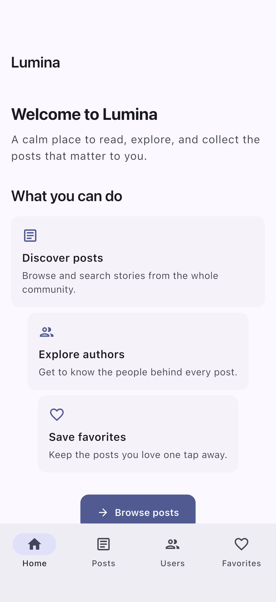
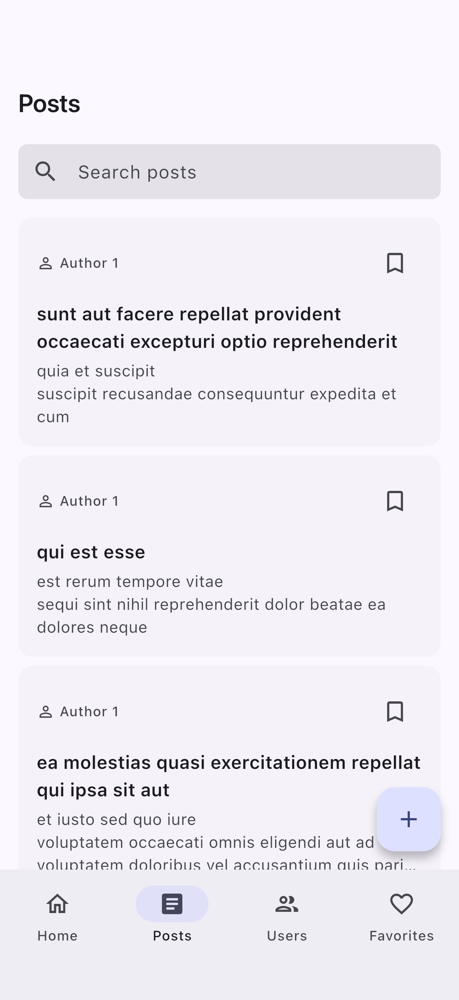
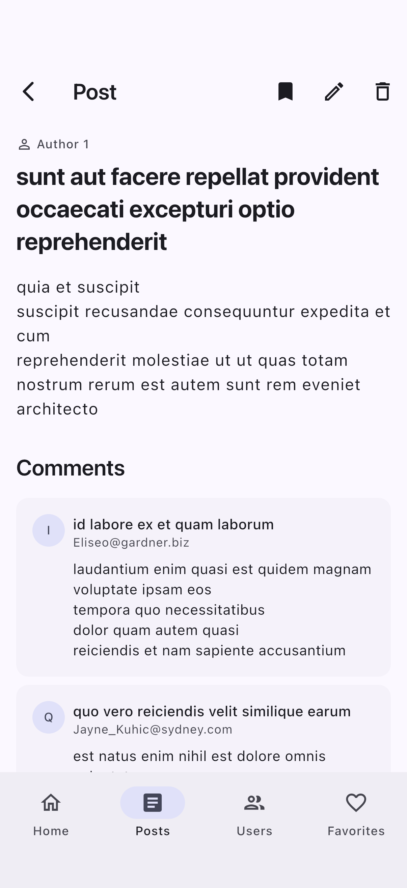
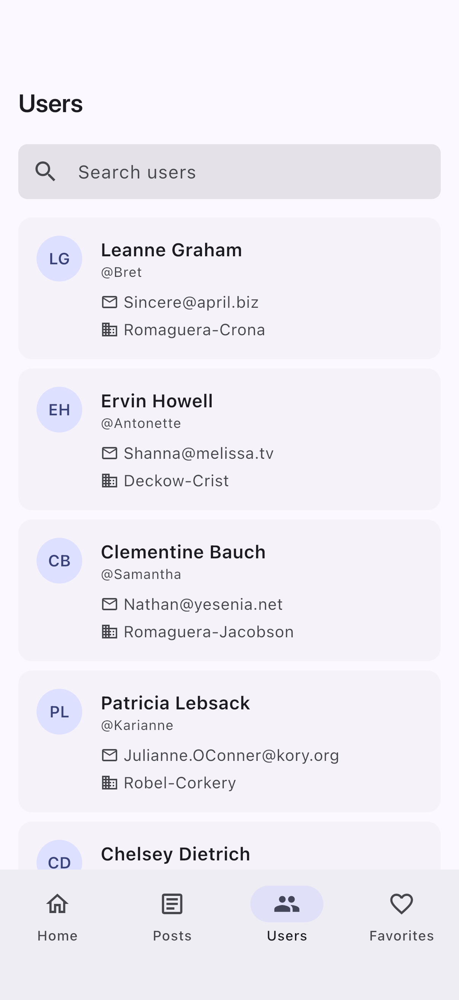
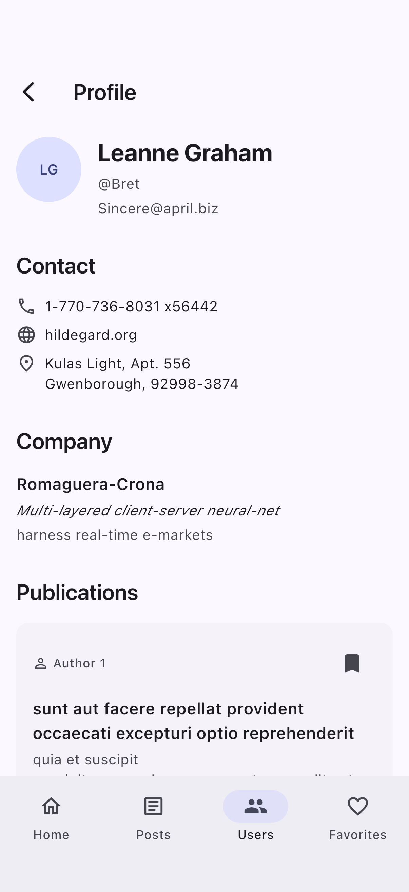
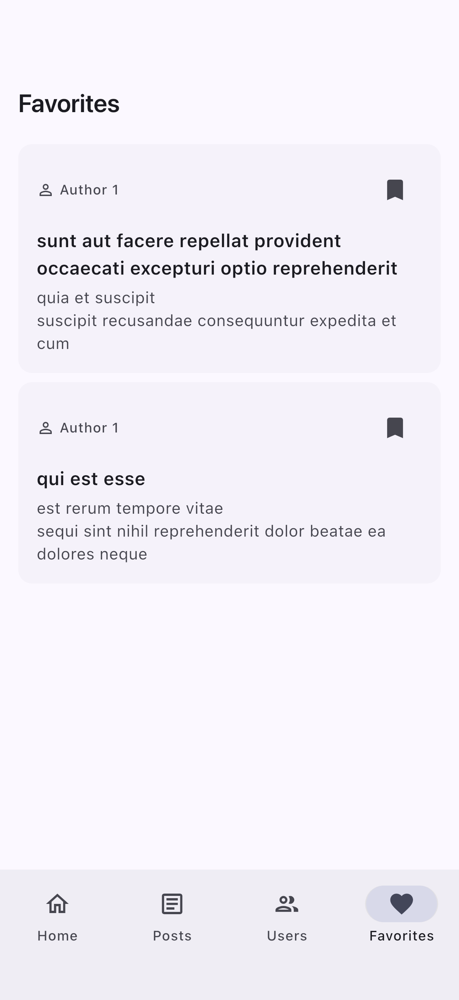

# Lumina

A Flutter client for the [JSONPlaceholder](https://jsonplaceholder.typicode.com) API: browse posts, comments, and users, search and filter content, create, edit, and delete posts, and keep local favorites.

## Features

- Four-tab navigation — Home, Posts, Users, Favorites — with each tab's state preserved while switching.
- Posts feed with case-insensitive title/body search, pull-to-refresh, and distinct loading, empty, and error states with retry.
- Post details on a deep-link-compatible route (`/posts/:id`) with the full text and comments, which load independently with their own loading, empty, error/retry, and pull-to-refresh states.
- Users directory with search across name, username, email, and company. Each profile (`/users/:id`) shows contact and company details plus the user's publications with the same independent state handling.
- Creating, editing, and deleting posts with inline validation, submission progress, and input preserved on failure; deletion asks for confirmation and removes the post from every list, including Favorites.
- Favorites toggle on every post card and details page. Bookmarked IDs persist in SharedPreferences and restore on startup; favorite state is derived by post ID, so one toggle updates every screen at once. The Favorites tab reuses already loaded posts and fetches the rest individually.
- Adaptive layout: page content is width-capped and centered on large screens, the users list switches to two columns on wide layouts, and every screen stays usable from a small phone in landscape up to a tablet.
- Typed error handling end to end: repositories map transport errors to `AppFailure` values, and the UI shows human-readable messages, never raw exceptions.

## Mutations and the local overlay

JSONPlaceholder accepts `POST`, `PATCH`, and `DELETE` requests and answers them successfully, but never persists changes — every subsequent read returns the original data. To make mutations durable on the device, the app keeps a local overlay in SharedPreferences and merges it over every remote read:

- **Created posts** are sent to the server first, then stored locally with negative IDs allocated from a persisted counter (`-1`, `-2`, …), so they can never collide with server-assigned IDs. The ID echoed by the server is ignored because it is not unique across requests. Created posts survive app restarts.
- **Edited posts** are patched remotely first (skipped for locally created posts, which the server does not know), then the final version is stored locally: edits to created posts replace the stored original, edits to remote posts are kept in an updates map keyed by post ID.
- **Deleted posts** are deleted remotely first (again skipped for locally created posts, which are simply removed), then the ID is recorded so reads suppress the post.

Merge order for every read: locally created posts (newest first), followed by the remote list in its original order with deleted posts removed and edited posts replaced in place. Refreshing any screen re-applies the overlay, so local changes never disappear behind a pull-to-refresh. Single-post reads resolve created, edited, and deleted IDs from the overlay before touching the network.

Storage corruption is handled conservatively: individually malformed entries are skipped and cleaned up by the next write, unreadable top-level values surface a typed parsing failure, and the negative-ID counter is re-derived below the lowest stored ID if it is missing or corrupted.

Known limitation: if the remote call succeeds but local persistence then fails, the app reports the failure and does not pretend the mutation succeeded; there is no rollback of the (non-persistent) remote call.

## Deletion and favorites

Deleting a post also removes its bookmark, coordinated at the application layer — the posts repository knows nothing about favorites. If removing the bookmark fails, the deletion itself stands and the favorites failure is reported through the standard favorites feedback. Editing a post preserves its favorite status, and new posts start unbookmarked. Locally created posts can be bookmarked like any other post: favorite storage accepts their negative IDs and rejects only the zero sentinel.

## Architecture

The codebase is feature-first: `lib/features/<feature>/` holds posts, users, comments, and favorites, with shared infrastructure in `lib/core/` (networking, storage, error mapping, design-system widgets) and app-level composition in `lib/app/` (theme, router, navigation shell).

Each feature is split into layers with dependencies pointing inward:

- **domain** — entities and abstract repositories; depends on no other layer.
- **data** — DTOs, remote/local data sources, mappers, and repository implementations; depends only on domain and core.
- **application** — Riverpod controllers and screen state; depends on domain and the feature's DI file.
- **presentation** — pages and widgets; depends on application, domain, and shared UI components.

Provider registrations live outside the layers in a per-feature composition root, `lib/features/<feature>/di.dart`, which wires data sources and repositories behind their domain interfaces (`Provider<PostsRepository>` and so on). No layer declares providers itself, so application code never imports the data layer, and tests replace any dependency with `ProviderScope` overrides.

Other notable decisions:

- Shared UI building blocks live in `lib/core/widgets` — `EmptyStateView`, `ErrorStateView`, `AppSearchField`, skeletons, and the page scaffold — so every feature renders its states through the same components.
- State synchronization after a mutation is push-based: active controllers are patched in place (posts list, open details, favorites feed cache) so screens update without refetch flicker and the search query survives, while user profiles are invalidated and re-read through the overlay because an edit can move a post between authors.
- Author selection in the post form uses the loaded users list; if it cannot be loaded, the form falls back to a validated numeric author ID field rather than blocking submission.
- Remote and local persistence stay in separate data sources behind a single repository; no DTOs or storage types leak past it.

## Tech stack

- **Flutter** 3.44.0 (stable) / **Dart** 3.12.0
- Riverpod (state management & DI), Dio (networking), go_router (navigation)
- go_router `StatefulShellRoute.indexedStack` for state-preserving bottom-tab navigation
- Centralized design tokens (colors, spacing, radius, typography) feeding a single Material 3 theme
- Freezed + json_serializable (immutable models & DTO parsing)
- SharedPreferences (local persistence of favorite post IDs and the post overlay)

## Testing

```sh
flutter test
```

The suite covers the data layer (data sources, repositories, the mutation overlay), the application controllers, and widget tests for every screen, plus an adaptive-layout smoke test that walks the main flows on four screen sizes — from a small phone in landscape to a tablet — and fails on any layout overflow. All tests run against in-memory fakes and mocks; none require the real API or network access.

Screenshots in `docs/screenshots/` are captured by an integration driver against the live API:

```sh
flutter drive --driver=test_driver/integration_test.dart \
  --target=integration_test/screenshots.dart -d <device>
```

## Screenshots

| Home | Posts | Post details |
| --- | --- | --- |
|  |  |  |

| Users | User profile | Favorites |
| --- | --- | --- |
|  |  |  |

## Getting started

```sh
flutter pub get
dart run build_runner build --delete-conflicting-outputs
flutter run
```
